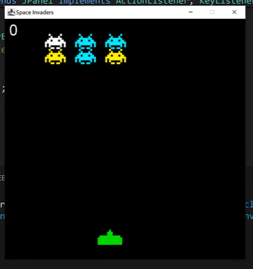
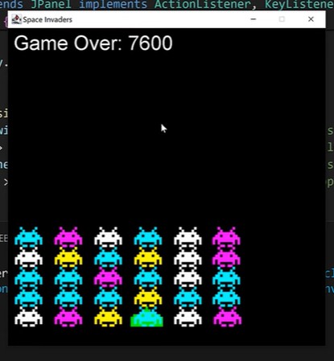

# 🛸 Space Invaders - Java Swing Game

## Overview
This is a simple implementation of the classic arcade game **Space Invaders** built using Java Swing. The player controls a spaceship at the bottom of the screen, shooting bullets to destroy descending waves of alien invaders. The game features progressive difficulty, scoring, and a game over condition when aliens reach the player's level.


Key features:
- Player spaceship movement (left/right) and shooting (spacebar).
- Alien waves that move horizontally and descend upon hitting screen edges.
- Collision detection between bullets and aliens.
- Score tracking with bonus points for clearing waves.
- Increasing difficulty: More aliens and rows as levels progress.
- Game restart on any key press after game over.

The game uses colored rectangles for graphics (no external images required) to keep it lightweight and self-contained.


## Screenshots

### In-Game (Active Play)

*(Shows the player ship (cyan rectangle) at the bottom, green alien rectangles moving across the top, white bullets firing, and current score displayed.)*

### Game Over

*(Displays "Game Over: 7600" score with remaining aliens visible. Press any key to restart.)*

*(Note: Screenshots are based on the running game; actual visuals use simple colored shapes for ship (cyan), aliens (green), and bullets (white).)*

## Requirements
- Java Development Kit (JDK) 8 or higher.
- No external libraries or assets needed.

## How to Run
1. Clone or download the project files (`SpaceInvaders.java` and `App.java`).
2. Compile the code:
   ```
   javac SpaceInvaders.java App.java
   ```
3. Run the application:
   ```
   java App
   ```
4. The game window (512x512 pixels) will open automatically.


## Controls
- **Left Arrow (←)**: Move ship left.
- **Right Arrow (→)**: Move ship right.
- **Spacebar**: Shoot a bullet.
- **Any Key**: Restart the game after "Game Over".


## Game Mechanics
- **Aliens**: Start with 2 rows and 3 columns of aliens. They move left/right and descend when hitting the screen edges. Destroy all to advance to the next level (more aliens added).
- **Bullets**: Fired from the ship; travel upward and disappear on alien hit or off-screen.
- **Scoring**:
  - 100 points per alien destroyed.
  - Bonus: 100 points × (rows × columns) for clearing a wave.
- **Game Over**: Triggers if any alien reaches the ship's Y-level.
- **Difficulty**: Alien columns cap at 6, rows at 10. Movement speed is fixed but wave density increases.

## Code Structure
- **SpaceInvaders.java**: Core game logic.
  - `Block` inner class: Represents game objects (ship, aliens, bullets) with position, size, and state.
  - `paintComponent` and `draw`: Renders graphics using `Graphics` (rectangles for simplicity).
  - `move`: Updates positions, handles collisions, and level progression.
  - `actionPerformed`: Game loop (60 FPS timer).
  - `keyReleased`: Handles input.
- **App.java**: Entry point; sets up the JFrame and adds the game panel.

The code is modular, with clear separation of drawing, movement, and input handling. Collision detection uses simple rectangle overlap checks.

## Potential Improvements
- Add sound effects (using `javax.sound`).
- Introduce alien shooting or varied enemy types.
- Power-ups or multiple lives.
- High score persistence (file I/O).

## License
This project is open-source and free to use/modify. Created for educational purposes.

---

*Built with ❤️ using Java Swing. Inspired by the 1978 Atari classic.*
